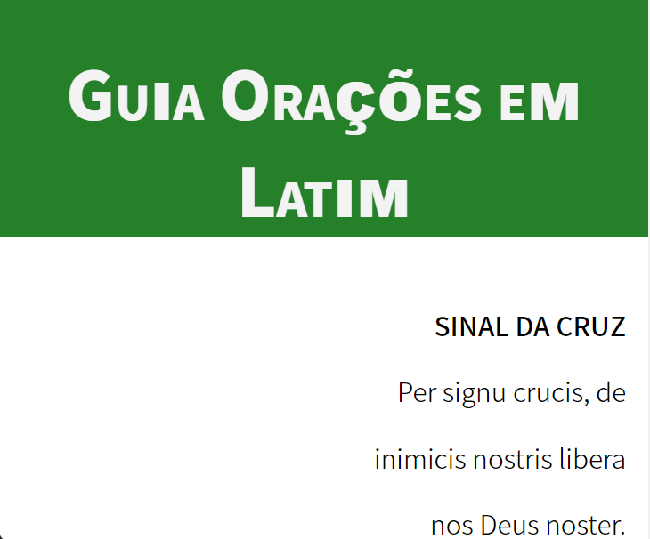
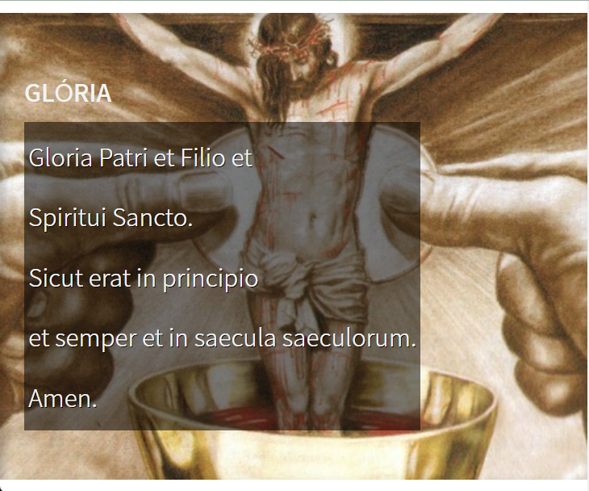

  
  

 

## 🖥️ Projeto

Guia em latim com algumas orações, principalmente as que estão no Rosário, para as pessoas incentivar as pessoas a falar um novo idioma. A cor verde foi inspiradas nas cores que são usadas no tempo comum litúrgico.

## 🚀 Ferramentas

Softwares e tecnologias que foram usadas para desenvolver o projeto.

- Figma
- Visual Studio Code
- HTML
- CSS

## 🌐 Referências das imagens

Menções dos lugares que foram retiradas as imagens para a construção do projeto.

- Na oração do [Glória](https://soundcloud.com/tiago-sartori-199548932/solenidade-do-santissimo-corpo-e-sangue-de-cristo-quinta-feira)
- Na oração do [Ave-Maria](https://salvaimerainha.org.br/nossa-senhora-de-fatima/)
- Na oração do [Vinde, Espírito Santo](https://formacao.cancaonova.com/espiritualidade/espirito-santo/o-poder-da-acao-transformadora-espirito-santo/)

## 🏷️ Layout

Você pode visualizar o layout do projeto através [desse link](https://www.figma.com/file/vdQ1htU8hlHYB2OF9rkqdh/Ora%C3%A7%C3%B5es-em-Latim?type=design&node-id=0%3A1&mode=design&t=1aBv3DE0eEzlvTrb-1). É necessário ter uma conta no [Figma](https://www.figma.com).
